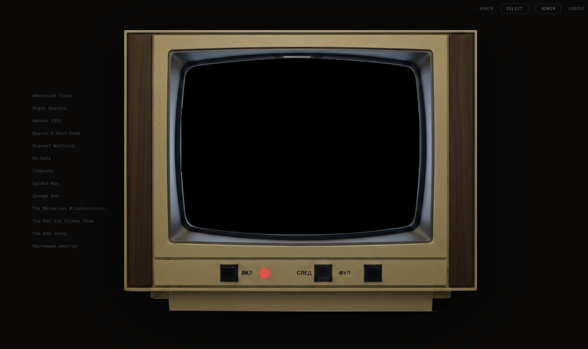

# mult_tv



Self-hosted streaming app for watching TV shows. Drop MP4 files on the server, open the web UI, and watch — with multi-user auth, watch history, and a built-in torrent client.

## Stack

- **Backend:** Python / FastAPI
- **Frontend:** React + Tailwind (single `index.html`, no build step)
- **Database:** SQLite
- **Reverse proxy:** Caddy
- **Torrent client:** Transmission

## Setup

**1. Create required directories and an empty database:**

```bash
./setup.sh
```

**2. Set Transmission credentials in `mult_tv/.env`:**

```env
TRANSMISSION_USER=admin
TRANSMISSION_PASS=yourpassword
```

**3. Point Caddy at your domain — edit `mult_tv/Caddyfile`:**

```
your.domain.com {
    reverse_proxy web_tv:8000
}
```

**4. Build and start:**

```bash
cd mult_tv
docker-compose up --build
```

On first start the app generates a random admin password and prints it to the container logs:

```bash
docker-compose logs web_tv | grep -i admin
```

## Video files

Place MP4 files under `mult_tv/downloads/complete/<show_name>/`. The directory name becomes the show name in the UI.

```
downloads/
└── complete/
    ├── Breaking Bad/
    │   ├── s01e01.mp4
    │   └── s01e02.mp4
    └── The Wire/
        └── s01e01.mp4
```

To convert MKV/AVI files to MP4 (picks the right audio track automatically):

```bash
./convert.sh /path/to/videos "rus|russian"
# or
./convert.sh /path/to/videos "eng|english"
```

## Torrent downloads

Transmission is available at `http://your.domain.com/transmission/` (admin login required). Completed downloads land in `downloads/complete/` automatically.

## Users

| Role  | Can do |
|-------|--------|
| user  | Watch videos, report issues |
| admin | All of the above + manage users, validate/delete videos, access Transmission |

User management is available in the admin panel in the web UI.
